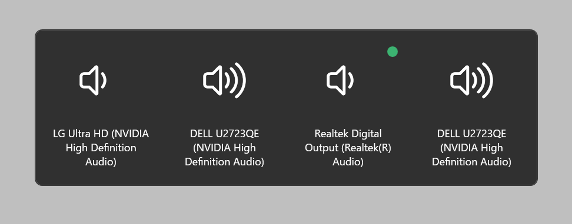
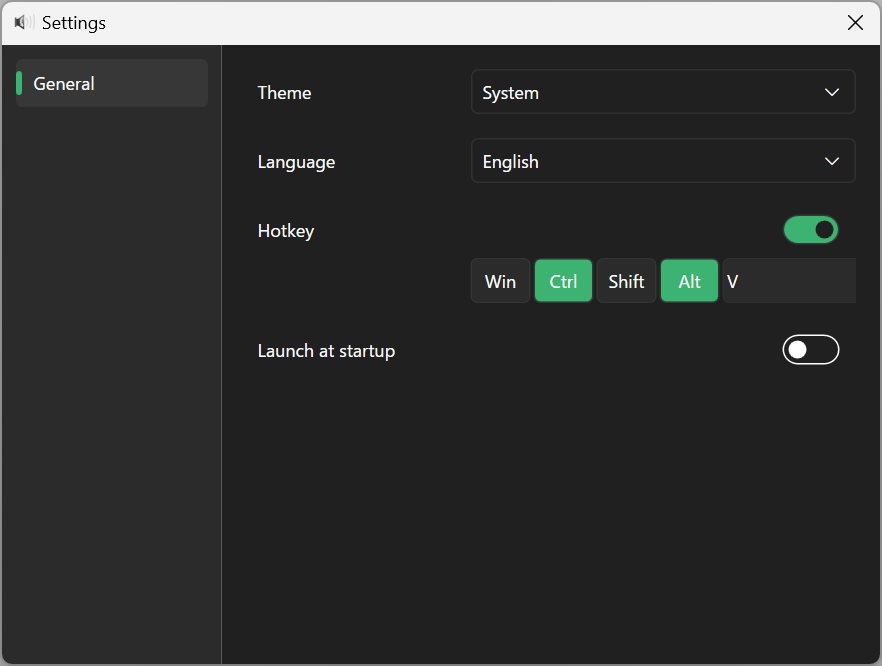

# AudioSelector

This is a simple audio output selection tool for Windows.

## Install

You can download the software from the Microsoft Store from the banner below. A portable version is also available from Releases.

## Usage

When the executable file is run, it will be stored in the task tray.

## Selection screen

- By pressing Ctrl + Alt + V keys or double-clicking the task tray icon. The selection screen will appear.

- The currently selected device is indicated by a green circle.

- Select the output device by moving the selected device with the tab key and pressing the Enter key, or by clicking the mouse on the device you want to output.

## Settings

Right click on the task tray icon and select "Settings" to launch the settings window.

### Theme

This setting allows you to change the appearance of the application. You can choose from the following three themes.

- Light

- Dark

- System (Synchronize with system settings)

### Hotkey

You can set the shortcut key for starting the Selection screen. The default setting is “Ctrl + Alt + V”.

The selected modifier key is highlighted in green. The last text box can be set to any one key.

If the key has been changed, it will also be displayed in a tooltip in the taskbar.

### Launch at Startup

If enabled, the application is automatically launched at system startup.

## TroubleShooting

- When the same application is launched twice
  
  

  A notification will appear in the task tray indicating that it is in place.

- "Hotkey registration failed. Please change the hotkey combination to be registered."

  
  
  The cause of this error indicates that the selected hotkey or default hotkey is already registered in another application. In this case, the error can be resolved by changing the hotkey setting to another key combination.

## Development environment

- NET 8.0
- Windows 11 24H2

## License

- MIT License
