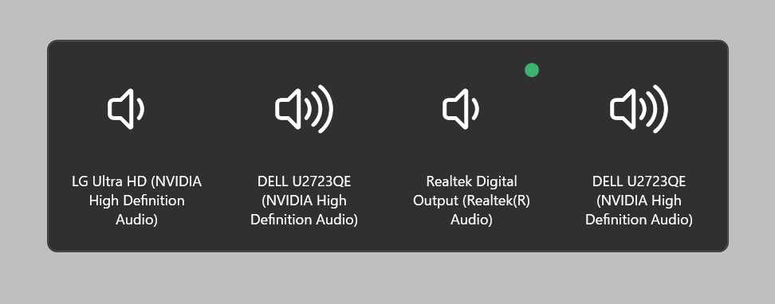

When the executable file is run, it will be stored in the task tray.

## Selection screen

- By pressing Ctrl + Alt + V keys or double-clicking the task tray icon. The selection screen will appear.

- The currently selected device is indicated by a green circle.

- Select the output device by moving the selected device with the tab key and pressing the Enter key, or by clicking the mouse on the device you want to output.

## Settings

Right click on the task tray icon and select "Settings" to launch the settings window.

### Theme

This setting allows you to change the appearance of the application. You can choose from the following three themes.

- Light

- Dark

- System (Synchronize with system settings)

### Hotkey

You can set the shortcut key for starting the Selection screen. The default setting is “Ctrl + Alt + V”.

The selected modifier key is highlighted in green. The last text box can be set to any one key.

### Launch at Startup

Enabled: The application is automatically launched at system startup.

Disabled: Applications are not automatically launched at system startup.